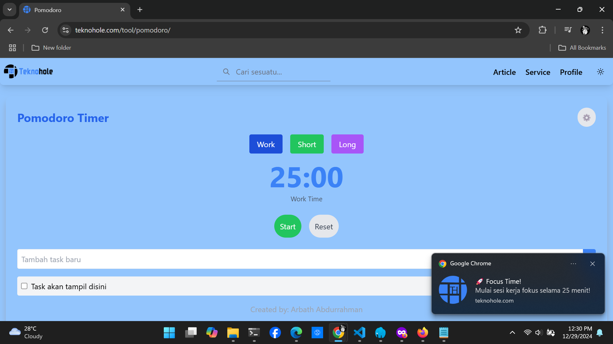
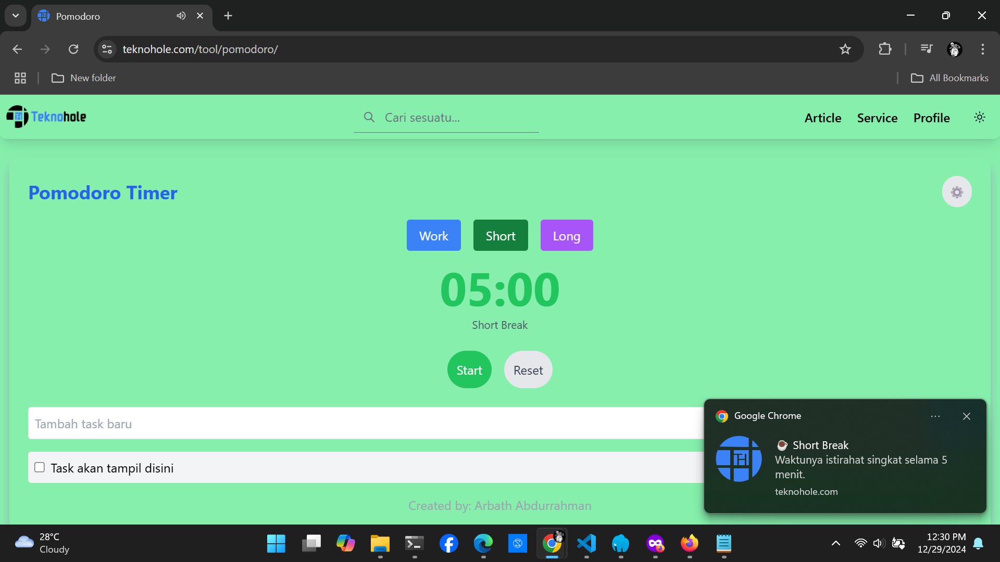
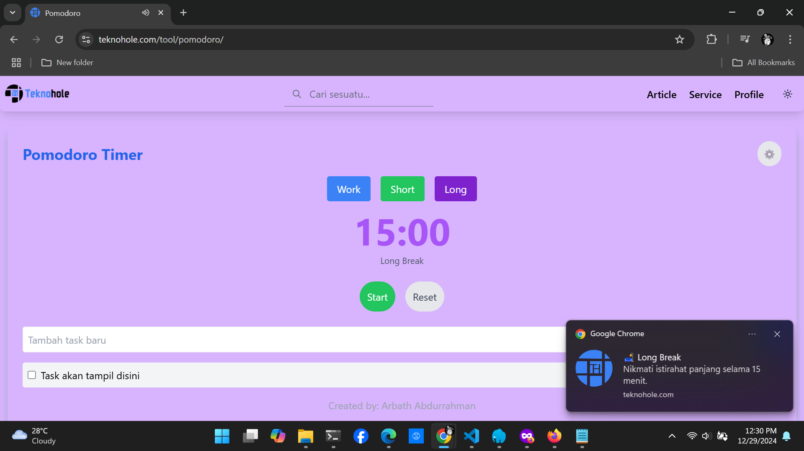
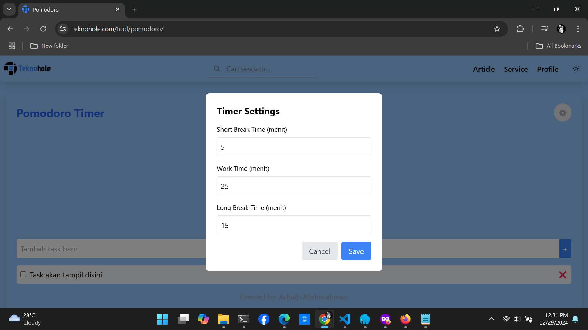

# Pomodoro Timer

Aplikasi web Pomodoro Timer modern dengan berbagai fitur yang dibangun menggunakan HTML, JavaScript, dan Tailwind CSS. Aplikasi ini membantu Anda mengelola sesi belajar secara efektif menggunakan Teknik Pomodoro.

[Kunjungi Website](https://teknohole.com/tool/pomodoro/)

## Fitur

- **Beberapa Mode Timer**
  - Sesi Kerja (Default: 25 menit)
  - Istirahat Pendek (Default: 5 menit)
  - Istirahat Panjang (Default: 15 menit)

- **Pengaturan yang Dapat Disesuaikan**
  - Durasi kerja dan istirahat yang dapat diatur
  - Pengaturan tersimpan antar sesi menggunakan localStorage
  - Dapat disesuaikan melalui modal pengaturan yang intuitif

- **Manajemen Tugas**
  - Tambah, selesaikan, dan hapus tugas
  - Penyimpanan tugas menggunakan localStorage
  - Fungsi checkbox untuk menandai tugas yang selesai
  - Hapus tugas secara individual

- **Pengalaman Pengguna yang Ditingkatkan**
  - Notifikasi browser saat timer selesai
  - Umpan balik visual dengan mode timer berkode warna
  - Desain responsif yang bekerja di semua perangkat
  - Warna latar berubah berdasarkan mode saat ini
  - Musik relaksasi saat waktu istirahat

- **Fitur Siklus Otomatis**
  - Beralih secara otomatis antara sesi kerja dan istirahat
  - Istirahat panjang setelah setiap 4 sesi kerja
  - Penghitung sesi untuk melacak kemajuan

## Tampilan Aplikasi

### Mode Kerja


### Mode Istirahat



### Pengaturan



## Instalasi

1. Clone repositori:
```bash
git clone [https://github.com/ArbathAbdurrahman/Pomodoro]
```

2. Masuk ke direktori proyek:
```bash
cd pomodoro-timer
```

3. Buka `index.html` di browser web Anda.

## Cara Penggunaan

1. **Kontrol Timer**
   - Klik "Start" untuk memulai timer
   - Gunakan "Pause" untuk menghentikan timer sementara
   - Tombol "Reset" untuk mengulang sesi saat ini
   - Beralih antar mode menggunakan tombol Work/Short/Long

2. **Pengaturan**
   - Klik ikon ⚙️ untuk membuka pengaturan
   - Sesuaikan durasi kerja dan istirahat
   - Simpan perubahan untuk menyimpan pengaturan

3. **Manajemen Tugas**
   - Masukkan deskripsi tugas di kolom input
   - Tekan Enter atau klik "+" untuk menambah tugas
   - Centang kotak untuk menandai tugas selesai
   - Klik ❌ untuk menghapus tugas

## Detail Teknis

### Teknologi yang Digunakan
- HTML5
- JavaScript (ES6+)
- Tailwind CSS
- Browser Notifications API
- Web Audio API
- LocalStorage API

### Dukungan Browser
- Chrome (direkomendasikan)
- Firefox
- Safari
- Edge

### Penyimpanan Lokal
Aplikasi menggunakan localStorage untuk menyimpan:
- Pengaturan timer
- Daftar tugas
- Preferensi pengguna

## Cara Berkontribusi

1. Fork repositori
2. Buat branch fitur Anda (`git checkout -b fitur/FiturKeren`)
3. Commit perubahan Anda (`git commit -m 'Menambahkan FiturKeren'`)
4. Push ke branch (`git push origin fitur/FiturKeren`)
5. Buka Pull Request

## Kredit

- Dibuat oleh: Arbath Abdurrahman

## Lisensi

Proyek ini dilisensikan di bawah Lisensi MIT - lihat file LICENSE untuk detail.